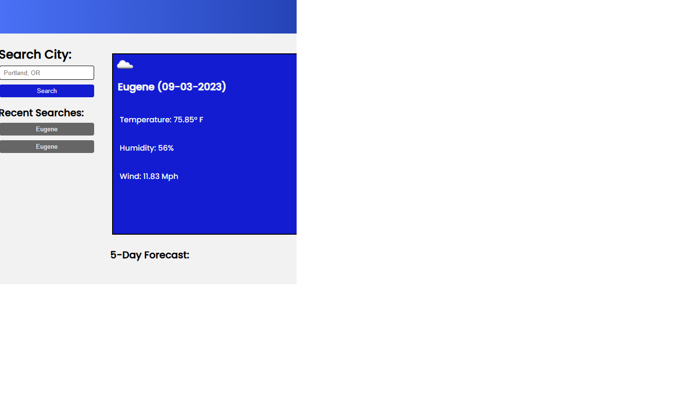

# Weather Forecast App

This project uses the Open Weather API to provide a weekly forecast of weather for any city that you search. It also uses local storage to save recently searched cities which can be extracted again from Open Weather's API when the recently searched city is clicked on again. The completed project can be visited [here](https://dsatpm.github.io/weather_forecast)

## Use

This project is for anyone that needs to know the weather of their local city, or anywhere else in the world. It also provides a 5-day forecast to give an outlook on what to expect with the weather

## Visual

Screenshot of the project:  

## License

[MIT](https://choosealicense.com/licenses/mit)

## Credits

This project was created by [dsatpm](https://twitter.com/__dsatpm) using the [OpenWeatherAPI](https://openweathermap.org/api). I also referenced [ChatGPT](https://chat.openai.com), [webdocs](https://developer.mozilla.org), and [Google](https://google.com) for research and documentation to get everything working properly and functionally. Additional help on API functionality from Cody Schwengler.

## Contact

For any questions or comments, you can reach me at [Twitter](https://twitter.com/__dsatpm). Thank you for looking at my project!

## Roadmap

This project is mostly complete, save for some possible responsive alterations that may need to be addressed.